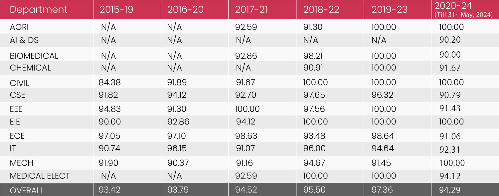
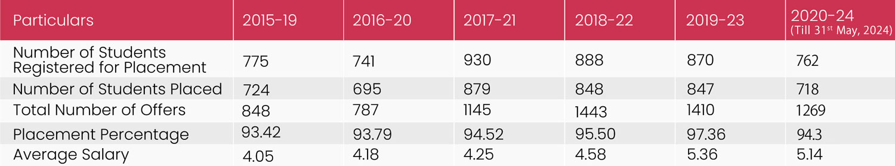

## index.html

```
<!DOCTYPE html>
<html lang="en">
<head>
    <meta charset="UTF-8">
    <meta name="viewport" content="width=device-width, initial-scale=1.0">
    <title>Document</title>
    <style>
        a{
            
            
            color: rgb(238, 11, 11);
            font-family: Arial;
            font-size: 20px;
            width: 55%; 
            padding: 15px;
            padding-left: 80px;
            text-decoration: none;
        }
        a:hover{
            color: gray;
            text-decoration: none;
        }
        .column2{
            background-color: antiquewhite;
        }
        .input{
          width: 350px;
          padding-top: 20px;
          padding-left: 50px;  
        }
        
    </style>
    <title>Document</title>
    <link href="https://cdn.jsdelivr.net/npm/bootstrap@5.3.3/dist/css/bootstrap.min.css" rel="stylesheet"
    integrity="sha384-QWTKZyjpPEjISv5WaRU9OFeRpok6YctnYmDr5pNlyT2bRjXh0JMhjY6hW+ALEwIH" crossorigin="anonymous">
    
</head>
<body style="background-color: bisque;">
    <div class="row">
    <div style="display: flex;">
        <div style="width: 25%;">
          
        </div>
        <div>
    <a href="">Home</a>
    <a href="Academics.html">Academics</a>
    <a href="admission.html">Admission</a>
    <a href="gallery.html">Gallery</a>
    <a href="placement.html">Placements</a>
    </div>
<div class="input">
    <div class="input-group mb-3">
      <span class="input-group-text" id="basic-addon1"><i class="bi bi-search"></i><svg xmlns="http://www.w3.org/2000/svg" width="16" height="16" fill="currentColor" class="bi bi-search" viewBox="0 0 16 16">
        <path d="M11.742 10.344a6.5 6.5 0 1 0-1.397 1.398h-.001q.044.06.098.115l3.85 3.85a1 1 0 0 0 1.415-1.414l-3.85-3.85a1 1 0 0 0-.115-.1zM12 6.5a5.5 5.5 0 1 1-11 0 5.5 5.5 0 0 1 11 0"/>
      </svg></span>
      <input type="text" class="form-control" placeholder="Search here..." aria-label="Username" aria-describedby="basic-addon1">
    </div>
  </div>
</div>
    <br>
    <!-- <div class="column1">
        <div></div>

    </div> -->
<div class="column2"></div>
    <center><div style="width: 60%;"  id="carouselExampleIndicators" class="carousel slide" data-bs-ride="carousel" data-bs-interval="1000">
        <div class="carousel-indicators" >
          <button type="button" data-bs-target="#carouselExampleIndicators" data-bs-slide-to="0" class="active" aria-current="true" aria-label="Slide 1"></button>
          <button type="button" data-bs-target="#carouselExampleIndicators" data-bs-slide-to="1" aria-label="Slide 2"></button>
          <button type="button" data-bs-target="#carouselExampleIndicators" data-bs-slide-to="2" aria-label="Slide 3"></button>
        </div>
        <div class="carousel-inner" >
          <div class="carousel-item active">
            
          </div>
          <div class="carousel-item">
            
          </div>
          <div class="carousel-item">
            
          </div>
        </div>
        <button class="carousel-control-prev" type="button" data-bs-target="#carouselExampleIndicators" data-bs-slide="prev">
          <span class="carousel-control-prev-icon" aria-hidden="true"></span>
          <span class="visually-hidden">Previous</span>
        </button>
        <button class="carousel-control-next" type="button" data-bs-target="#carouselExampleIndicators" data-bs-slide="next">
          <span class="carousel-control-next-icon" aria-hidden="true"></span>
          <span class="visually-hidden">Next</span>
        </button>
      </div></center>
      <script src="https://cdn.jsdelivr.net/npm/bootstrap@5.3.3/dist/js/bootstrap.bundle.min.js"
    integrity="sha384-YvpcrYf0tY3lHB60NNkmXc5s9fDVZLESaAA55NDzOxhy9GkcIdslK1eN7N6jIeHz"
    crossorigin="anonymous"></script>
</body>
</html>

```

## placement.html

```
<!DOCTYPE html>
<html lang="en">
<head>
    <meta charset="UTF-8">
    <meta name="viewport" content="width=device-width, initial-scale=1.0">
    <title>Document</title>
    <style>a{
        padding: 15px;
        text-decoration: none;
        color: rgb(238, 11, 11);
        font-family: Arial;
        font-size: 20px;
    }
    a:hover{
        color: gray;
    }</style>
    <link href="https://cdn.jsdelivr.net/npm/bootstrap@5.3.3/dist/css/bootstrap.min.css" rel="stylesheet"
    integrity="sha384-QWTKZyjpPEjISv5WaRU9OFeRpok6YctnYmDr5pNlyT2bRjXh0JMhjY6hW+ALEwIH" crossorigin="anonymous">
</head>
<body>
    <div style="font-family: 'Gill Sans', 'Gill Sans MT', Calibri, 'Trebuchet MS', sans-serif;font-size: large;">
        <h1>Overview//</h1>
        <p>
            At SEC - Saveetha Engineering College (Autonomous), we offer a dynamic blend of 'Training and Placement' strategies designed to empower learners to secure their dream jobs. This unique integrated approach is woven into the academic fabric from Year One, ensuring that learners develop not just technical prowess but also the soft skills crucial for professional success. With faculty who bring extensive industrial experience to the classroom, SEC is more than an institution; it's a launchpad for super dream offers and illustrious careers.
Our unique methodology ensures you are not just ready but ahead in the job market:
<br>
<ul>
<li><b>Industry-Synced Training:</b> Our hands-on approach, through Centers of Excellence and live projects, prepares learners for real-world challenges. <br></li>
<li><b>Strategic Placement Preparation:</b> From day one, we integrate placement training with academics. Tailored workshops, resume building, and interview prep sessions, guided by experts, equip you for top-tier job opportunities. <br></li>
<li><b>Robust Industry Links:</b> Leverage our strong connections with over 500+ leading companies for internships and in-plant training, giving learners a competitive edge in the job market. <br></li>
</ul>
        </p> 
    </div>

    <div style="font-family: 'Gill Sans', 'Gill Sans MT', Calibri, 'Trebuchet MS', sans-serif;font-size: large;">
            <h1>Department Wise Placement Details//</h1>
       <center> </center>
       
    </div>

    <!-- <div style="font-family: 'Gill Sans', 'Gill Sans MT', Calibri, 'Trebuchet MS', sans-serif;font-size: large;">
        <h1>Statistics//</h1>
   <center> </center>
   
</div> -->
<div>
    <center><svg xmlns="http://www.w3.org/2000/svg" width="16" height="16" fill="currentColor" class="bi bi-house-fill" viewBox="0 0 16 16">
        <path d="M8.707 1.5a1 1 0 0 0-1.414 0L.646 8.146a.5.5 0 0 0 .708.708L8 2.207l6.646 6.647a.5.5 0 0 0 .708-.708L13 5.793V2.5a.5.5 0 0 0-.5-.5h-1a.5.5 0 0 0-.5.5v1.293z"/>
        <path d="m8 3.293 6 6V13.5a1.5 1.5 0 0 1-1.5 1.5h-9A1.5 1.5 0 0 1 2 13.5V9.293z"/>
      </svg><a href="index.html"><i class="bi bi-house-fill"></i>Home</a></center></div>
    
</body>
</html>
```

## gallery.html

```
<!DOCTYPE html>
<html lang="en">
<head>
    <meta charset="UTF-8">
    <meta name="viewport" content="width=device-width, initial-scale=1.0">
    <title>Document</title>
    <link href="https://cdn.jsdelivr.net/npm/bootstrap@5.3.3/dist/css/bootstrap.min.css" rel="stylesheet"
    integrity="sha384-QWTKZyjpPEjISv5WaRU9OFeRpok6YctnYmDr5pNlyT2bRjXh0JMhjY6hW+ALEwIH" crossorigin="anonymous">
    <style>a{
        padding: 15px;
        text-decoration: none;
        color: rgb(238, 11, 11);
        font-family: Arial;
        font-size: 20px;
    }
    a:hover{
        color: gray;
    }</style>
</head>
<body>
    <center><div style="width: 60%;"  id="carouselExampleIndicators" class="carousel slide" data-bs-ride="carousel"data-bs-interval="1000">
        <div class="carousel-indicators" >
          <button type="button" data-bs-target="#carouselExampleIndicators" data-bs-slide-to="0" class="active" aria-current="true" aria-label="Slide 1"></button>
          <button type="button" data-bs-target="#carouselExampleIndicators" data-bs-slide-to="1" aria-label="Slide 2"></button>
          <button type="button" data-bs-target="#carouselExampleIndicators" data-bs-slide-to="2" aria-label="Slide 3"></button>
        </div>
        <div class="carousel-inner" >
          <div class="carousel-item active">
            
          </div>
          <div class="carousel-item">
            
          </div>
          <div class="carousel-item">
            
          </div>
        </div>
        <button class="carousel-control-prev" type="button" data-bs-target="#carouselExampleIndicators" data-bs-slide="prev">
          <span class="carousel-control-prev-icon" aria-hidden="true"></span>
          <span class="visually-hidden">Previous</span>
        </button>
        <button class="carousel-control-next" type="button" data-bs-target="#carouselExampleIndicators" data-bs-slide="next">
          <span class="carousel-control-next-icon" aria-hidden="true"></span>
          <span class="visually-hidden">Next</span>
        </button>
      </div></center>
      <script src="https://cdn.jsdelivr.net/npm/bootstrap@5.3.3/dist/js/bootstrap.bundle.min.js"
    integrity="sha384-YvpcrYf0tY3lHB60NNkmXc5s9fDVZLESaAA55NDzOxhy9GkcIdslK1eN7N6jIeHz"
    crossorigin="anonymous"></script>

    <center><svg xmlns="http://www.w3.org/2000/svg" width="16" height="16" fill="currentColor" class="bi bi-house-fill" viewBox="0 0 16 16">
        <path d="M8.707 1.5a1 1 0 0 0-1.414 0L.646 8.146a.5.5 0 0 0 .708.708L8 2.207l6.646 6.647a.5.5 0 0 0 .708-.708L13 5.793V2.5a.5.5 0 0 0-.5-.5h-1a.5.5 0 0 0-.5.5v1.293z"/>
        <path d="m8 3.293 6 6V13.5a1.5 1.5 0 0 1-1.5 1.5h-9A1.5 1.5 0 0 1 2 13.5V9.293z"/>
      </svg><a href="index.html"><i class="bi bi-house-fill"></i>Home</a></center></div>
    
</body>
</html>
```

## Academics.html

```
<!DOCTYPE html>
<html lang="en">
<head>
    <meta charset="UTF-8">
    <meta name="viewport" content="width=device-width, initial-scale=1.0">
    <title>Document</title>
    <link rel="stylesheet" href="html.css">
    
</head>
<body>
    <center>
      <div class="card">
        <div class="card-inner">
          <div class="card-front">
            
          </div>
          <div class="card-back">
            
            <p>Welcome to SEC - Saveetha Engineering College (Autonomous), a distinguished institution established in 2001 under the visionary leadership of Dr. V. Vijaya Chamundeeswari a committed medical professional and philanthropist par excellence. With over 35 years of unwavering commitment to excellence in education, our college has emerged as the forefront of engineering education and research. <br></p>
          </div>
        </div>
      </div>
    </center>
    <div>
        <br> <br>

        <br> <br>
        <center><svg xmlns="http://www.w3.org/2000/svg" width="16" height="16" fill="currentColor" class="bi bi-house-fill" viewBox="0 0 16 16">
            <path d="M8.707 1.5a1 1 0 0 0-1.414 0L.646 8.146a.5.5 0 0 0 .708.708L8 2.207l6.646 6.647a.5.5 0 0 0 .708-.708L13 5.793V2.5a.5.5 0 0 0-.5-.5h-1a.5.5 0 0 0-.5.5v1.293z"/>
            <path d="m8 3.293 6 6V13.5a1.5 1.5 0 0 1-1.5 1.5h-9A1.5 1.5 0 0 1 2 13.5V9.293z"/>
          </svg><a href="index.html"><i class="bi bi-house-fill"></i>Home</a></center></div>
</body>
</html>
```

## admission.html

```
<!DOCTYPE html>
<html lang="en">
<head>
    <meta charset="UTF-8">
    <meta name="viewport" content="width=device-width, initial-scale=1.0">
    <title>Document</title>
    
    <style>
        table, th, td {
          border:1px solid black;
         
        }
        
        a{
            padding: 15px;
            text-decoration: none;
            color: rgb(238, 11, 11);
            font-family: Arial;
            font-size: 20px;
        }
        a:hover{
            color: gray;
        }
    
    </style>
        
</head>
<body>
    <center><div>
        <table style="width: 100%;height: 70%;align-items: center;">
            <tr>
              <th>
                UG Courses</th>
              <th>Total Number of Seats
                (Regular / 4 Years)</th>
              <th>Total Number of Seats
                (Lateral Entry / 3 Years)</th>
            </tr>
           <tr>
            <td>B.E. Computer Science and Engineering</td>
            <td>300</td>
            <td>30</td>
           </tr>
           <tr>
            <td>B.E. Electronics and Communication Engineering</td>
            <td>200</td>
            <td>20</td>
           </tr>
           <tr>
            <td>B.E. Civil Engineering</td>
            <td>50</td>
            <td>10</td>
           </tr>
           <tr>
            <td>B.Tech. Agricultural Engineering</td>
            <td>30</td>
            <td>3</td>
           </tr>
           <tr>
            <td>B.Tech Artificial Intelligence and Machine Learning</td>
            <td>70</td>
            <td>7</td>
           </tr>
          </table>
    </div></center>

    <br>
    <br>
    <br>
    <br>
    <br>

    
    <div>
    <center><svg xmlns="http://www.w3.org/2000/svg" width="16" height="16" fill="currentColor" class="bi bi-house-fill" viewBox="0 0 16 16">
        <path d="M8.707 1.5a1 1 0 0 0-1.414 0L.646 8.146a.5.5 0 0 0 .708.708L8 2.207l6.646 6.647a.5.5 0 0 0 .708-.708L13 5.793V2.5a.5.5 0 0 0-.5-.5h-1a.5.5 0 0 0-.5.5v1.293z"/>
        <path d="m8 3.293 6 6V13.5a1.5 1.5 0 0 1-1.5 1.5h-9A1.5 1.5 0 0 1 2 13.5V9.293z"/>
      </svg><a href="index.html"><i class="bi bi-house-fill"></i>Home</a></center></div>
    
</body>
</html>

```

## OUTPUT


